# PROYECTO MISCUENTAS version App movil

Aplicacion Android para proyecto MisCuentas del ciclo DAM en MonteCastelo.

[](https://kotlinlang.org/)
[](https://leocare.dev/docs/license/)


- [App android con Kotlin para proyecto MisCuentas](#PROYECTO-MISCUENTAS-version-App-movil)
   - [Acerca de..](#acerca-de)
      - [Notas Sobre el Desarrollo](#Notas-Sobre-el-Desarrollo)
      - [Tecnologías Utilizadas](#Tecnologías-Utilizadas)
      - [Características](#Características)
      - [Librerias](#librerias)
      - [Aplicaciones que forman parte de este proyecto](#aplicaciones-que-forman-parte-de-este-proyecto)
   - [Arquitectura de la Aplicación](#Arquitectura-de-la-Aplicación)
   - [Ejemplos de Modelos](#Ejemplos-de-Modelos)
   - [Requisitos de Permisos](#Requisitos-de-Permisos)
   - [Tecnologías Utilizadas](#Tecnologías-Utilizadas)
   - [Instalación](#Instalación)
   - [Uso](#uso)
   - [Autor](#autor)
     - [Contacto](#contacto)
   - [Contribucion](#contribucion)
   - [Licencia](#licencia)


## Acerca de..

Bienvenido a la aplicación MISCUENTAS, una app móvil desarrollada en Kotlin que permite a los usuarios gestionar sus gastos compartidos de manera fácil y eficiente. 
La aplicación incluye funcionalidades como el registro de usuarios, la creación de hojas de cálculo para gastos, el manejo de participantes y la captura de imágenes como recibos.
Los gastos y pagos registrados pueden tener una imagen adjunta como comprobante. 
Los usuarios pueden ser locales (gestionados manualmente por cada usuario) o en línea (compartiendo una hoja de gastos con otros usuarios en la nube).

---
## Notas Sobre el Desarrollo

- La aplicación se apoya en ViewModel para gestionar los estados de la interfaz de usuario y facilitar el acceso a la base de datos.
- Las imágenes capturadas se guardan en el directorio de DCIM/Camera y se referencian mediante su URI en la base de datos local.
- Para mejorar la experiencia del usuario, se implementa un menú lateral solo disponible en la pantalla de Inicio, donde los usuarios pueden acceder fácilmente a las distintas funcionalidades. </br>
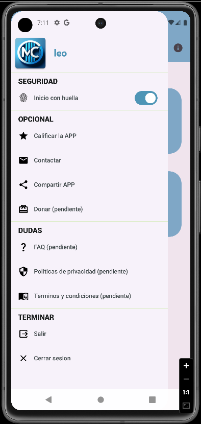
### Tecnologías Utilizadas

- **Kotlin:** Lenguaje principal de desarrollo para la app móvil.
- **Jetpack Compose:** Para diseño de interfaces de usuario modernas y reactivas.
- **Room:** Biblioteca de persistencia para almacenar datos localmente en una base de datos SQLite.
- **Hilt:** Para la inyección de dependencias y simplificaar la estructura del código.
- **Ktor:** API REST backend para gestionar la comunicción del servidor.
- **Android Jetpack:** Múltiples componentes de Android Jetpack, como Navigation, ViewModel, LiveData y DataStore.

### Características

1. Registro de Usuarios
Permite a los usuarios registrarse en la aplicación proporcionando su nombre, correo electrónico y contraseña. Los registros se guardan en la base de datos externa en MySql.
   </br></br>
2. Hojas de Cálculo para Gastos
Los usuarios pueden crear hojas de cálculo para gestionar sus gastos. Se visualizan en 3 tipos:</br>
   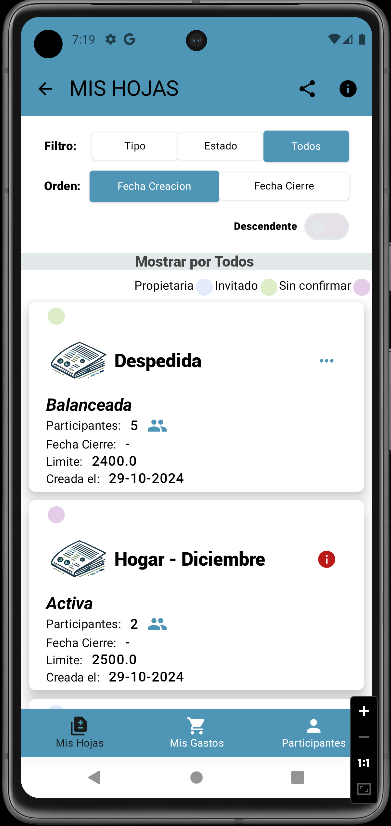
   - **Propietarias:** son aquellas creadas por el usuario en si mismo.
   - **Invitado:** hojas creadas por otros usuarios, los cuales nos han unido y hemos aceptado participtar.
   - **Sin Confirmar:** hojas creadas por otros usuarios, los cuales nos han unido y aun no hemos aceptado, teniendo la posibilidad de rechazar dicha invitacion.
   </br></br>
     
    Cada hoja incluye:
   - **Participantes:** Los participantes en cada hoja están asociados al registro principal y pueden agregar gastos.
   - **Gastos:** Los participantes pueden registrar sus gastos, con detalles como concepto, tipo, importe y fecha.
    </br></br>
3. Participantes
Los participates pueden ser Locales u Online. Los primeros son aquellos que gestionaremos nosotros, introduciendo sus gastos y demas, simulando una actividad por su parte.
Los Online son usuarios que tienen la aplicacion y comparten la hoja con nosotros. Para que un usuario sea Online debemos agregarlo indicando su correo en la ventana PARTICIPANTES.
   </br>   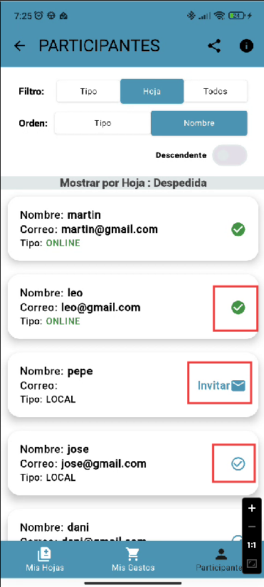
</br></br>
4. Balance y Deudas
La aplicación calcula automáticamente el balance de cada participante para conocer cómo se deben dividir los gastos y quién tiene deudas pendientes. Cada deuda es calculada en función del total de gastos y se registran las futuras liquidaciones.
   </br>   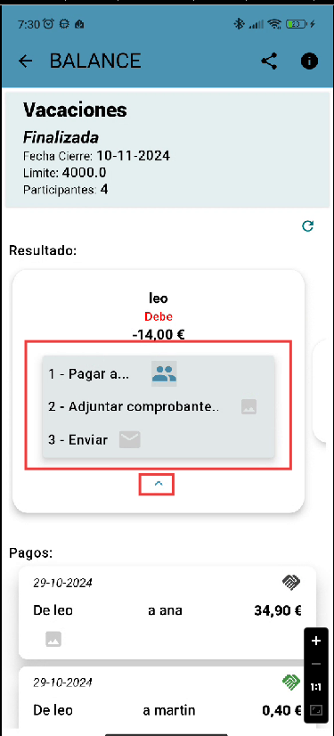 
   - **Resoluciones:** si debemos una cierta cantidad, la caja de resoluciones nos permitira seleccionar a quien hemos pagado, adjuntar un justificante y enviarle un correo informado.
</br></br>
5. Pagos
Una vez finalizada la HOJA se debe proceder a saldar las deudas, quien las tenga. Estos pagos deben ser confirmados por el participante que ha recibido el pago. (DICHO PAGO NO SE REALIZA DESDE LA APP).</br>
   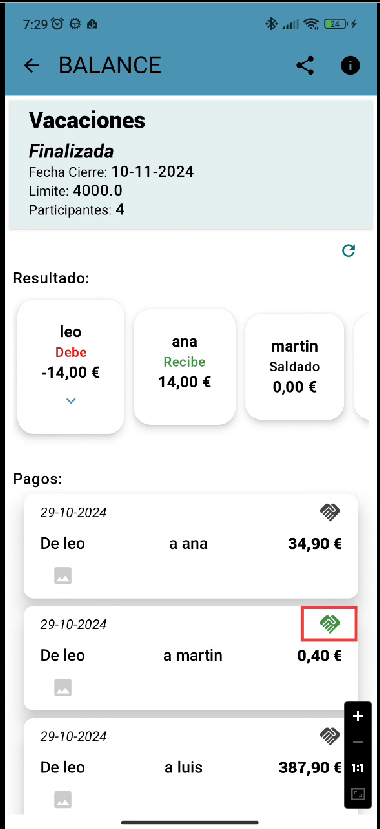
    - **Pagos:** los pagos se veran en la parte inferior. En ellos se refleja si ya se ha confirmado dicho pago por parte del acreedor.
</br></br>
6. Captura de Fotografías y Almacenamiento
Se proporciona una funcionalidad para tomar fotos (ej. recibos o comprobantes de gasto) y almacenarlas en la galería del dispositivo o en la base de datos local para referencia futura. 
Utilizamos FileProvider para la captura de imágenes y almacenaje en el dispositivo.</br>
   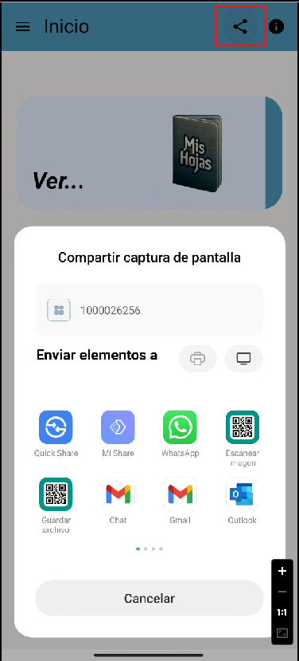
    - En la barra superior hay un boton con la opcion de compartir una captura de pantalla, por los distintos canales de comunicacion (EMAIL, WHATSAPP, SMS, ETC..)
      </br></br>
7. Navegación en la Aplicación
La navegación está gestionada a través de Jetpack Navigation, proporcionando transiciones suaves entre diferentes pantallas como:
   - **Splash Screen:** Pantalla inicial de bienvenida.
   - **Inicio:** Menú con opciones como crear nuevas hojas, acceder a gastos y ver balances.
   - **Mis Hojas:** Para ver todas las hojas de cálculo creadas y administrarlas.
   - **Participantes:** Mostrar los participantes de cada hoja de cálculo.
     </br></br>
8. Mas caracteristicas
 - **Avisos de Pago**: Envía recordatorios de pago o solicitudes de pago a otros usuarios.
 - **Comprobantes Adjuntos**: Permite adjuntar imágenes a los gastos o pagos como comprobante.
 - **Usuarios Locales y en Línea**: Gestiona usuarios locales o compárte hojas de gastos con otros usuarios.
 - **Inicio de Sesión con Huella**: Inicia sesión de manera rápida y segura usando la huella digital.
 - **Compartir Capturas y Enlaces**: Comparte capturas de pantalla de las hojas de gastos o el enlace de descarga de la aplicación.
 - **Contacto con el Desarrollador**: Fácil acceso para contactar con el desarrollador y enviar sugerencias.
 - **Calificar la App**: Permite calificar la aplicación para mejorar la experiencia de usuario.

### Librerias
En este proyecto se utilizan los siguientes plugins, librerias y servicios:
- JetpackCompose (Kit de herramientas)
- Accompanist-permissions (solicitud de permisos)
- Retrofit2 (servicio Rest)
- Biometric (uso huella digital)
- HILT (dependencias)
- Room (persistencia SqlLite)
- DataStore (persistencia Preferences)
- Bcrypt (encriptado)


### Aplicaciones que forman parte de este proyecto:
- #### [API REST con Ktor](https://github.com/LeoCare/ktor-Api-MisCuentas)
- #### [APP Escritorio TodoCuentas](https://github.com/LeoCare/MisCuentas_desk)
- #### [Servicio Windows](https://github.com/LeoCare/MailMyService)

---
## Arquitectura de la Aplicación

La arquitectura sigue el patrón MVVM (Model-View-ViewModel) utilizando las siguientes capas:

- **Model:** Define los datos principales de la aplicación, incluyendo Registro, HojaCalculo, Participante, Gasto, Deuda y Pago. Estos modelos se sincronizan con la base de datos Room.
- **ViewModel:** Gestiona la lógica de negocio y proporciona los datos requeridos por las vistas.
- **View:** Implementada con Jetpack Compose. Incluye varios elementos visuales como botones personalizados, LazyColumn para listas de gastos y diálogos para confirmar acciones.
---
## Ejemplos de Modelos

A continuación se muestra un ejemplo de los modelos utilizados en la aplicación:
   ```bash
   @Serializable
   data class HojaCalculo(
       val idHoja: Long,
       val titulo: String,
       val fechaCreacion: String?,
       val fechaCierre: String?,
       val limite: String?,
       val status: String,
       val idRegistroHoja: Long?
   )

   @Serializable
   data class Gasto(
       val idGasto: Long,
       val tipo: Long,
       val concepto: String,
       val importe: Double,
       val fechaGasto: String?,
       val idParticipanteGasto: Long?
   )
   ```
---
## Requisitos de Permisos

Para utilizar la cámara y guardar imágenes, la aplicación solicita los siguientes permisos:
- **Cámara:** Para tomar fotos.
- **Almacenamiento:** Para guardar imágenes en la galería del dispositivo.

La solición de permisos se gestiona utilizando rememberMultiplePermissionsState y depende de la versión de Android, diferenciando entre Android Tiramisu y versiones anteriores.

---
## Instalación
Necesitaras un entorno de desarrollo (IDE) como Android Studio o IntelliJ IDE.
Para este ejemplo se usa un dispositivo Movil fisico en una conexion local con la API, por lo que, la configuracion se hará en base a esto.

1. Clona este repositorio (si aun no lo tienes):
   ```bash
   git clone git@github.com:LeoCare/MisCuentas.git
   ```
2. Abre el proyecto en Android Studio.
3. Conecta el movil y acepta la trasferencia de archivos en él.
   </br>  </br>    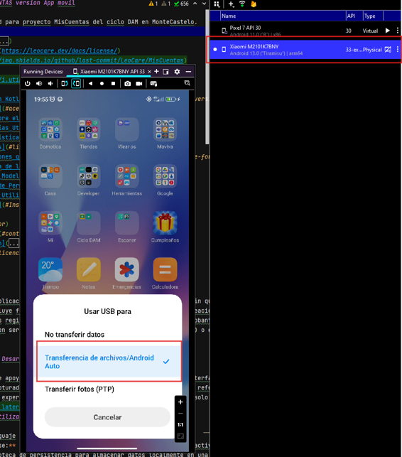
3. Configura las dependencias y la base de datos MySQL.
  - Una vez tengas la API funcionando, modifica los proveedores de Webservices en el fichero MisCuentasModule.kt, indicando la IP o direccion correspondiente...
    </br>  </br>    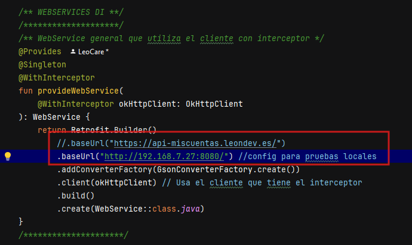
    </br>  </br>    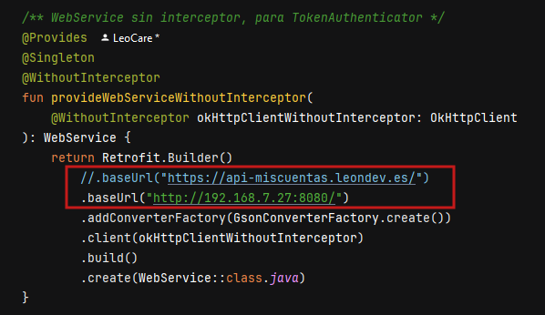
4. Crear archivo xml para permitir conexiones no seguras.
   </br>  </br>    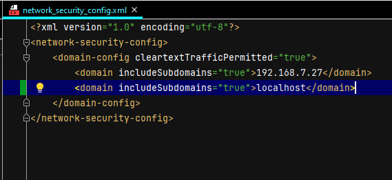
5. Configurar xml en el Manifest.
   </br>  </br>    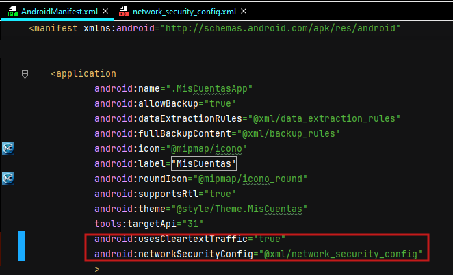
6. Compila y ejecuta la aplicación.
   </br>  </br>    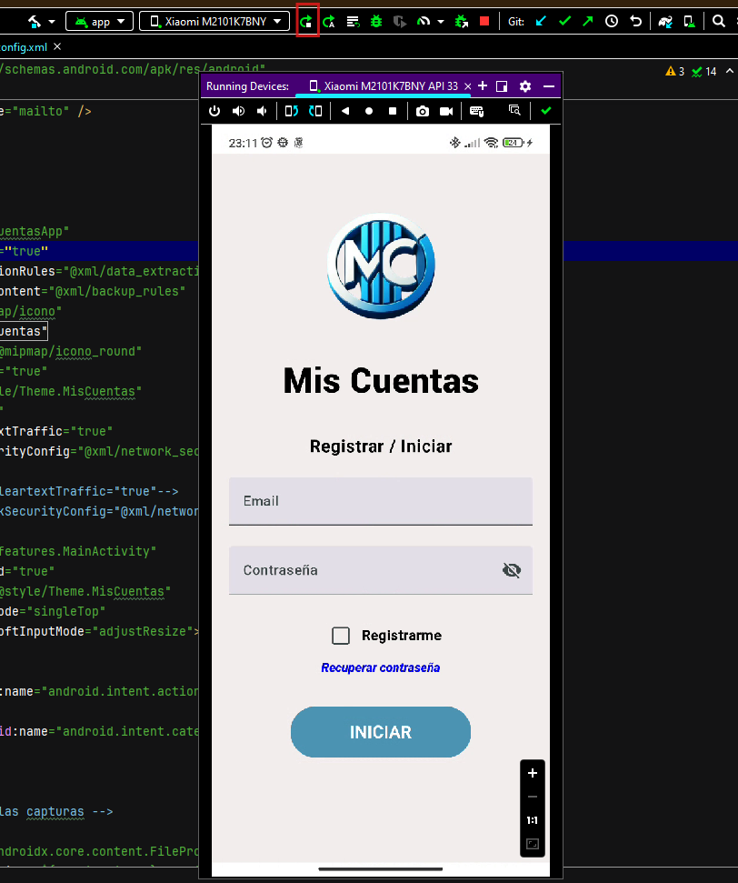
---
## Uso

1. Regístrate o inicia sesión con tu huella digital.
2. Crea una nueva hoja de gastos y añade participantes (locales o en línea).
3. Introduce los gastos, adjunta comprobantes si es necesario.
4. Finaliza la hoja de gastos para ver el balance y las cantidades a pagar.
5. Envía avisos de pago a los participantes para saldar las deudas.

---
## Autor
Mi nombre es <b>Leonardo David Care Prado</b>, soy tecnico en sistemas y desarrollador de aplicaciones multiplataforma, o eso espero con este proyecto...jjjjj.<br>
A fecha de este año (2024) llevo 4 años realizando trabajos de desarrollo para la misma empresa, ademas de soporte y sistemas.<br>
Estos desarrollos incluyen lenguajes como Html, C#, Xamarin, Oracle, Java y Kotlin.

[](https://www.w3schools.com/html/)
[](https://dotnet.microsoft.com/es-es/languages/csharp)
[](https://dotnet.microsoft.com/es-es/apps/xamarin)
[](https://www.oracle.com/es/)
[](https://www.java.com/es/)
[](https://kotlinlang.org/)

### Contacto
Para cualquier consulta o aporte puedes comunicarte conmigo por correo<br>
[leon1982care@gmail.com](https://mail.google.com/mail/u/0/?pli=1#inbox)
<p><a href="https://mail.google.com/mail/u/0/?pli=1#inbox" target="_blank">
        
</a></p> 

## Contribucion
Gracias a todos los que aporten nuevas ideas de como mejorar mi proyecto. Sientance libres de participar, cambiar u opinar sobre el mismo.</br>
Solo pido que al crear la rama, esta comience por 'contribucion/lo_que_aporteis'. Y, el commit sea claro y descriptivo.</br>
En caso de necesitar documentar los nuevos cambios, seguir con el uso de las libreria mensionada en el apartado [Documentaciones](#documentaciones).</br>
Muchisimas gracias a todos!

## Licencia
Este repositorio y todo su contenido estan bajo la licencia de **Creative Commons**. Solo pido que si haces uso de ella, me cites como el autor.</br>
<a rel="license" href="http://creativecommons.org/licenses/by-nc-sa/4.0/"></a>

<a rel="license" href="http://creativecommons.org/licenses/by-nc-sa/4.0/">Creative Commons
Attribution-NonCommercial-ShareAlike 4.0 International License</a>.
